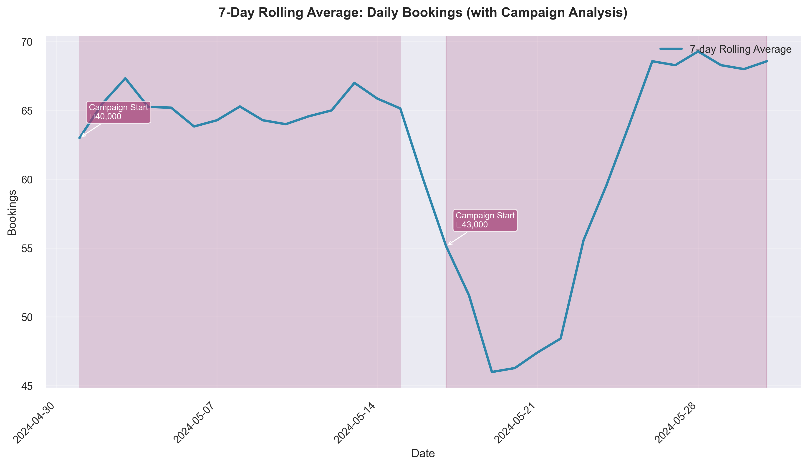

# Coastal Curry - Performance Summary (Last 30 Days)

### Cuisine and Locality
- **Cuisine**: South Indian
- **Locality**: Indiranagar, Bangalore

## 🚨 Executive Summary
- **Status**: HEALTHY
- **Key Alert**: No recent discount campaigns
- **Top Priority**: Introduce Limited-Time 10% Discount to stay competitive

## 1. Recent Performance Metrics

| Metric              | Value     |
|---------------------|-----------|
| Total Bookings      | 1,933     |
| Total Cancellations | 47        |
| Total Covers        | 5,525     |
| Total Revenue       | ₹4,415,488|

**KEY SALES METRICS**

| Metric               | Value   |
|----------------------|---------|
| **OPD (Orders Per Day)** | 62.35  |
| **Spend Per Cover**  | ₹799.18 |
| **Revenue per Booking** | ₹2,284.27 |
| **Cancellation Rate** | 2.43%  |
| **Average Rating**   | 4.66    |

## 2. Advertising Campaign Effectiveness

| Metric             | Value     |
|--------------------|-----------|
| Ad Campaign Duration | 30 days  |
| Total Ad Spend     | ₹83,000   |
| Total Impressions  | 73,000    |
| Total Clicks       | 7,300     |
| Total Conversions  | 876       |
| **Conversion Rate** | 12.0%    |
| Revenue Generated  | ₹377,400  |
| ROI                | 4.55      |

**Campaign Analysis**

| Metric                  | Campaign Period | Non-Campaign Period |
|-------------------------|-----------------|---------------------|
| Average Bookings        | 63.6            | 25.0                |
| Average Revenue         | ₹145,255.73     | ₹57,816.00          |

- During campaign periods, the average bookings increased by 154.4%, and the average revenue increased by 151.2% compared to non-campaign periods.

## 3. Discount Strategy Performance

- **Summary**: No recent discount campaigns

## 4. Peer Benchmarking Summary

### Core Metrics (bookings, revenue, rating)

| Metric       | Restaurant | Peers | Gap (%) |
|--------------|------------|-------|---------|
| Bookings     | 1,933      | 1,600 | +20.81  |
| Revenue      | ₹4,415,488 | ₹4,000,000 | +10.39  |
| Rating       | 4.66       | 4.7   | -0.75   |

**Key Insights:**
- The restaurant has a notable advantage in bookings with a +20.81% gap, indicating strong customer attraction.
- Revenue shows a positive gap of +10.39%, suggesting effective conversion of bookings to sales.
- The rating is broadly aligned with peers, with a minor gap of -0.75%, indicating competitive service quality.

### Advertising Performance

| Metric       | Restaurant | Peers | Gap (%) |
|--------------|------------|-------|---------|
| Avg Ad Spend | ₹2,766     | ₹2,500 | +10.67  |
| Ads ROI      | 4.55       | 4.2   | +8.26   |

**Key Insights:**
- The restaurant's advertising ROI shows a positive gap of +8.26%, indicating efficient ad spend.
- The ad spend is slightly higher than peers by +10.67%, suggesting a moderate investment in advertising.

### Discount Performance

| Metric                  | Restaurant | Peers | Gap (%)  |
|-------------------------|------------|-------|----------|
| Avg Discount Percentage | 0.0        | 10.0  | -100.0   |
| Discount ROI            | 0.0        | 3.5   | -100.0   |

**Key Insights:**
- Untapped opportunity - peers average a 10% discount, which could be leveraged to attract more customers.
- The absence of discounting results in a significant shortfall in discount ROI compared to peers.

## 5. Recommendations
- **Introduce Limited-Time 10% Discount**: Current 0% vs Target 10%. Launch to stay competitive and lift conversions by 10%.