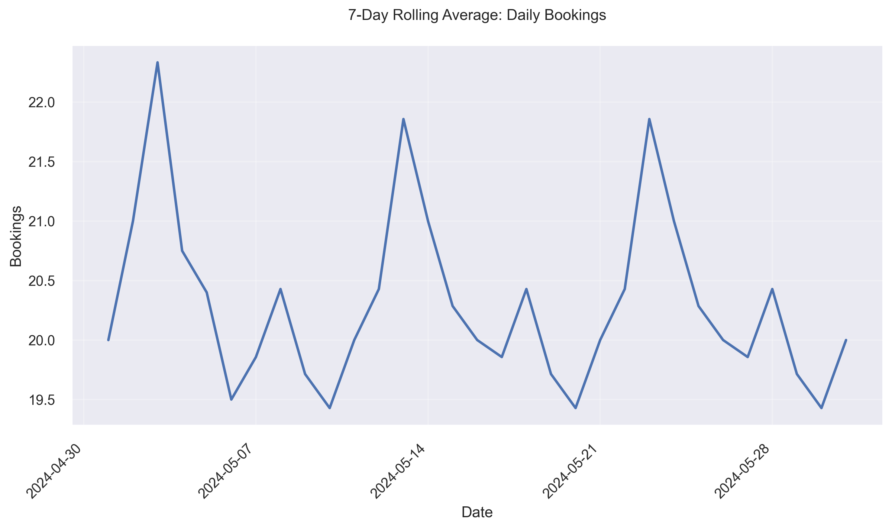

# Mysore Meals - Performance Summary (Last 30 Days)

### Cuisine and Locality
- **Cuisine**: South Indian
- **Locality**: Jayanagar, Bangalore

## 1. Recent Performance Metrics

| Metric                | Value          |
|-----------------------|----------------|
| Total Bookings        | 629            |
| Total Cancellations   | 50             |
| Total Covers          | 1840           |
| Total Revenue         | ₹918,250       |

| Metric                     | Value          |
|----------------------------|----------------|
| Average Daily Bookings     | 20.29          |
| Revenue per Booking        | ₹1,459.86      |
| Cancellation Rate          | 7.95%          |
| Average Rating             | 4.41           |

## 2. Advertising Campaign Effectiveness

- **Summary**: No recent advertising campaigns

## 3. Discount Strategy Performance

- **Summary**: No recent discount campaigns

## 4. Peer Benchmarking Summary

### Core Metrics (bookings, revenue, rating)

| Metric       | Restaurant Value | Peer Average | Gap (%)   |
|--------------|------------------|--------------|-----------|
| Bookings     | 629              | 850          | -26.0     |
| Revenue      | ₹918,250         | ₹1,400,000   | -34.41    |
| Rating       | 4.41             | 4.5          | -2.01     |

**Key Insights:**
- **Biggest Opportunity:** There is a significant shortfall in both bookings and revenue, with gaps of -26.0% and -34.41% respectively, indicating a need to boost customer engagement and sales.
- **Most Significant Strength:** The restaurant's rating is broadly aligned with peers, showing competitive service quality.
- **Overall:** The restaurant faces a substantial challenge in increasing its bookings and revenue to match peer performance.

### Advertising Performance

| Metric       | Restaurant Value | Peer Average | Gap (%)   |
|--------------|------------------|--------------|-----------|
| Ad Spend     | ₹0               | ₹1,333       | -100.0    |
| Ads ROI      | 0.0              | 4.1          | -100.0    |

**Key Insights:**
- **Untapped Opportunity:** The restaurant has not engaged in advertising, while peers average an ad spend of ₹1,333 with a notable ROI of 4.1. This represents a significant opportunity to explore advertising for potential growth.
- **Overall:** The absence of advertising activity suggests a missed opportunity to leverage marketing for increased visibility and customer acquisition.

### Discount Performance

| Metric                | Restaurant Value | Peer Average | Gap (%)   |
|-----------------------|------------------|--------------|-----------|
| Discount Percentage   | 0.0%             | 12.0%        | -100.0    |
| Discount ROI          | 0.0              | 3.3          | -100.0    |

**Key Insights:**
- **Untapped Opportunity:** The restaurant has not utilized discounts, whereas peers offer an average discount of 12.0% with a positive ROI of 3.3. Implementing strategic discounts could enhance competitiveness and attract more customers.
- **Overall:** The lack of discounting activity indicates a potential area for growth by adopting competitive pricing strategies to drive customer interest and sales.

## 5. Recommendations

- **Launch Initial Ad Campaign**: Current spend ₹0 vs target ₹1,333/day. Start with ₹1,000/day to boost bookings by 10-15%.
- **Drive Visibility**: Current bookings 629 vs target 850. Combine ads and discounts to close 26% gap.
- **Upsell Menu Items**: Current revenue ₹918,250 vs target ₹1,400,000. Focus on higher-value items to close 34% revenue gap.
- **Introduce 12% Discount**: Current discount 0% vs target 12%. Implement to lift conversions and stay competitive.