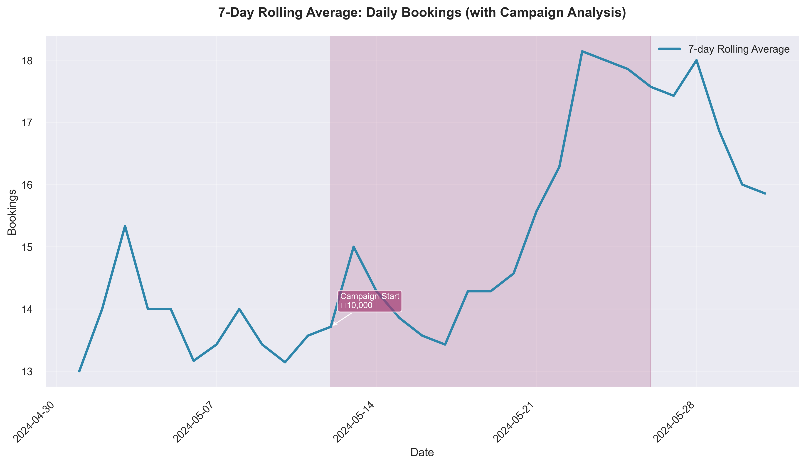

# Venice Villa - Performance Summary (Last 30 Days)

### Cuisine and Locality
- **Cuisine**: Italian
- **Locality**: Whitefield, Bangalore

## 1. Recent Performance Metrics

| Metric                | Value       |
|-----------------------|-------------|
| Total Bookings        | 469         |
| Total Cancellations   | 43          |
| Total Covers          | 1228        |
| Total Revenue         | ₹1,714,272  |

| Metric                     | Value       |
|----------------------------|-------------|
| Average Daily Bookings     | 15.13       |
| Revenue per Booking        | ₹3,655.16   |
| Cancellation Rate          | 9.17%       |
| Average Rating             | 3.81        |

## 2. Advertising Campaign Effectiveness

| Metric                | Value       |
|-----------------------|-------------|
| Ad Campaign Duration  | 15 days     |
| Total Ad Spend        | ₹10,000     |
| Impressions           | 15,000      |
| Clicks                | 750         |
| Conversions           | 38          |
| Revenue Generated     | ₹25,200     |
| ROI                   | 2.52        |

| Metric                  | Campaign Period | Non-Campaign Period |
|-------------------------|-----------------|---------------------|
| Average Bookings        | 15.87           | 14.44               |
| Average Revenue         | ₹57,959.07      | ₹52,805.38          |

- **Summary**: During campaign periods, the average bookings increased by approximately 9.9%, and the average revenue increased by about 9.8% compared to non-campaign periods.

## 3. Discount Strategy Performance

- **Summary**: No recent discount campaigns

## 4. Peer Benchmarking Summary

| Metric          | Restaurant Value | Peer Average | Gap (%)   |
|-----------------|------------------|--------------|-----------|
| Total Bookings  | 469              | 600          | -21.83    |
| Total Revenue   | ₹1,714,272       | ₹1,800,000   | -4.76     |
| Rating          | 3.81             | 4.1          | -7.08     |

**Key Insights:**
- **Biggest opportunity**: There is a "Material gap" in total bookings with a -21.83% difference, indicating a need to attract more customers.
- **Most significant strength**: The restaurant's revenue is "Broadly aligned" with peers, showing competitive performance in revenue generation.
- **Rating**: The restaurant's rating shows a moderate shortfall compared to peers, suggesting room for improvement in customer satisfaction.

| Metric          | Restaurant Value | Peer Average | Gap (%)   |
|-----------------|------------------|--------------|-----------|
| Avg Ad Spend    | ₹666             | ₹1,066       | -37.5     |
| Ads ROI         | 2.52             | 3.5          | -28.0     |

**Key Insights:**
- **Biggest opportunity**: There is a "Significant shortfall" in ads ROI with a -28.0% gap, indicating inefficient ad spending.
- **Most significant strength**: None, as both ad spend and ROI are below peer averages.
- **Ad Spend**: The restaurant spends significantly less on advertising than peers, which may contribute to the lower ROI.

| Metric                  | Restaurant Value | Peer Average | Gap (%)   |
|-------------------------|------------------|--------------|-----------|
| Avg Discount Percentage | 0.0              | 15.0         | -100.0    |
| Discount ROI            | 0.0              | 2.9          | -100.0    |

**Key Insights:**
- **Untapped opportunity**: The restaurant currently offers no discounts, while peers average a 15% discount, suggesting a potential area to explore for attracting more customers.
- **Discount ROI**: With no discount strategy in place, the restaurant misses out on potential ROI benefits seen by peers.

## 5. Recommendations

- **Optimize Creatives & Targeting**: Current ROI 2.52 vs Target 3.5. Refine strategy to lift ROI by 39%.
- **Introduce Limited-Time 15% Discount**: Current 0% vs Target 15%. Launch to stay competitive and boost conversions.
- **Drive Visibility (Ads + Discounts)**: Current 469 bookings vs Target 600. Implement to close 22% bookings gap.
- **Improve Service Touchpoints & Prompt Reviews**: Current rating 3.81 vs Target 4.1. Enhance service to increase rating by 8%.